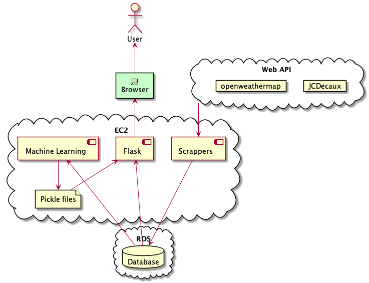
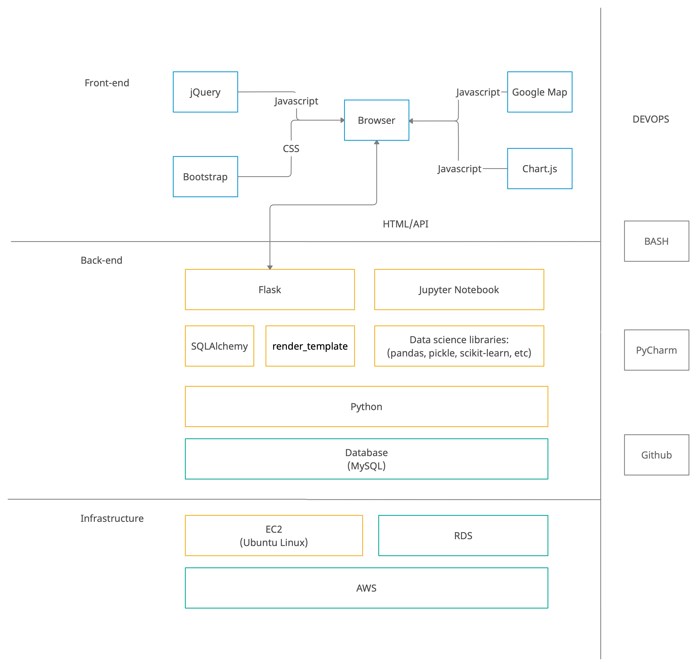
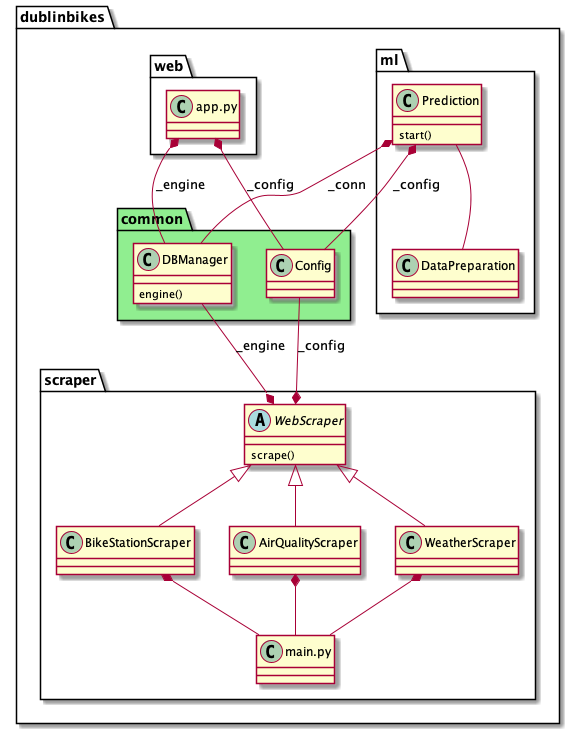
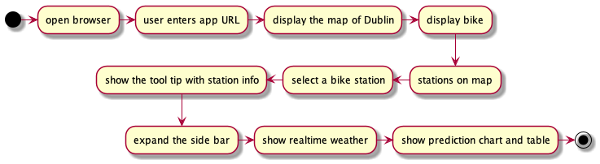

# DublinBikes
*This was a Project Created By the three contributors of this Github, the below is a snippet of the full documentation. Built over a period of time utilizing the Scrum Management system*

---

## Designs
*To view all the figures, view the Documentation Directory*

*Jupyter notebook for Machine Learning is not included*

## Application architecture
The application consists of three main components, which are Scrapers, Flask and Machine Learning.

The Scrapers collect data from Web APIs and save this data in the database, which will be used by the Flask API to display the real-time information on the website.
The Machine Learning module loads historical data from the database and trains the model to generate pickle files that will later be used to predict the available bikes and free bike stands based on future time and weather.
Finally, Flask serves the API and web contents. It reads the database for real-time information and pickle files for predictions.

The separation of the modules by functionalities makes the application easy to scale. All the modules can be developed, maintained and deployed respectively. Even inside of the scrapers and Flask Structure, the programs are split by subclasses or API’s.
The components are deployed on our EC2 instance and connect to the database created using RDS.

Figure 1: Application architecture diagram. Arrows show the data flow.

## Technology stack

The technologies used in this project are organised in the diagram below. A variety of libraries are employed, such as Google Maps for displaying the map and markers, Chart.js for prediction charts, SQLAlchemy for database access, data science libraries for machine  learning. Jupyter Notebook was the tool utilised in developing prediction models.
In terms of programming languages, front-end mainly uses javascript, back-end uses python (Flask) for web services and machine learning, and SQL for databases. We also have a DEVOPS process that is built on Bash, including conda env installation, application deployment, etc. They are implemented in the scripts under /scripts folder.
velopers use PyCharm as the IDE and Github for version control.

Figure 2: Tech stack diagram

## Class design

All the python codes are placed in the dublinbikes folder. There are four packages in it.

common: Utility modules like Config and DBManager which are shared across the whole project for maximum code reuse.
scraper: A superclass WebScraper defines the process for a scraper, the subclasses extends this class and implements the logic in concrete methods, i.e. _require_api(), _save_to_db() etc. The instance provides a public method scrape() only. The module main.py orchestrates the task scheduling.
web：The app.py is the Flask application.
ml: The prediction class is the main program that trains the prediction model. It relies on a separate module DataPreparation for data loading, cleaning and transformation.

The package structure organises the code in a logical way so that if we want to add more functionalities we can quickly identify where to put the class and reuse the utility code. It makes the code more readable and maintainable as well.

Figure 3: Class diagram

## User flow

The user flow is very straightforward. The user enters the URL in the browser to visit our website, and then the map will be shown with markers. Each marker stands for a bike station and when we click on it a brief containing  information will be displayed, meanwhile the side bar will be shown, which contains the details and predictions.

Figure 4: User flow

## Developer's Guide
If you are interested in running the application, please follow the 
instructions at [Run the project locally](documentation/developer-guide.md).

## Contributors
[Sean-Jay-M](https://github.com/Sean-Jay-M)  
[KingsleyLong](https://github.com/kingsleylong)    
[ClarenceWhite](https://github.com/ClarenceWhite)

---
